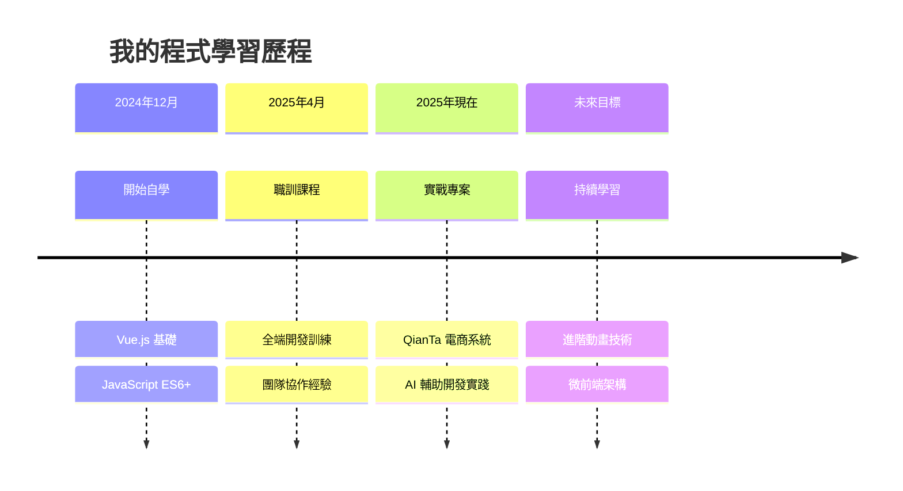

<div align="center">
  
# 👋 Hi, I'm 黃暉堯 (Qoo)


</div>

---

## 🎯 About Me

```typescript
const qoo = {
  location: "台中, Taiwan 🇹🇼",
  background: "金融業 → 程式開發",
  currentFocus: ["Full-Stack Development", "Web Animation", "Vue.js", "Express.js"],
  learningPath: "職訓局轉職課程 → 自主學習 → 實戰專案",
  motivation: "結合興趣培養可持續成長的第二專長",
  futureGoal: "全端開發 + 動畫互動體驗"
};
```

## 🛠 Tech Stack

### Frontend
<p>
  
  
  
  
  
  
</p>

### Backend & Database
<p>
  
  
  
  
</p>

### Tools & Libraries
<p>
  
  
  
  
  
</p>

## 📊 Learning Progress

<details>
<summary><b>🎯 技能熟練度</b></summary>

### Frontend Development
 **Vue.js** - 熟練掌握 Composition API
 **TypeScript** - 類型系統與介面設計
 **CSS/SCSS** - 響應式設計與動畫

### Backend Development  
 **Express.js** - RESTful API 設計
 **MySQL** - 資料庫設計與查詢
 **Node.js** - 持續學習中

### Animation & Interaction
 **GSAP** - ScrollTrigger 與互動動畫

</details>

## 🎨 Featured Projects

### 🛒 [QianTa 電商管理系統](https://github.com/Qoo143/QianTa)
> **全端電商專案** | 轉職課程畢業作品

<p>
  
  
  
  
</p>

**核心功能**：
- 🎭 **3D 商品展示** - Google Model Viewer 實現立體商品預覽
- ✨ **GSAP 滾動動畫** - ScrollTrigger 打造流暢視覺體驗  
- 🛍️ **完整購物流程** - 購物車、訂單、支付系統
- 👥 **權限管理** - JWT 身份驗證與前後台分離
- 📱 **響應式設計** - 適配桌面與移動端

**技術亮點**：前後台分離架構、Pinia 狀態管理、RESTful API 設計

---

## 📈 GitHub Stats

<div align="center">


</div>

<div align="center">
  


</div>

## 🌱 Learning Journey



## 💡 Development Philosophy

> **先求有，再求好** - 在有限時間內完成功能完整的專案  
> **AI 輔助開發** - 善用工具提升開發效率，專注於業務邏輯  
> **持續學習** - 從金融跨足程式，相信學習能力比技術更重要

## 📫 Let's Connect

<div align="center">

[](mailto:wayne676803@gmail.com)
[](https://github.com/Qoo143)

**📍 台中 | 🔍 積極尋求全端開發機會**

---


*"從金融到程式，每一行代碼都是新的可能"* 💻✨

</div>
